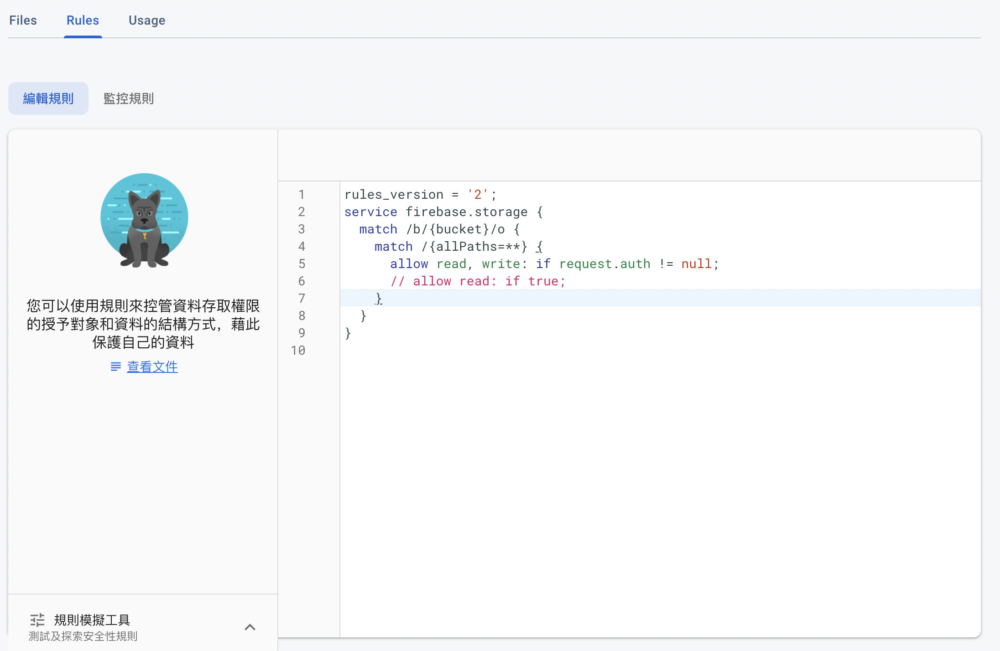

# 上傳圖片至 Firebase Stroage

##  設定 Storage 權限



## 連線至 Storage

### 方法一

```python
import firebase_admin
from firebase_admin import credentials
from firebase_admin import storage

cred = credentials.Certificate('path/to/service_account_key.json')
firebase_admin.initialize_app(cred, {
    'storageBucket': '<BUCKET_NAME>.appspot.com'
})

bucket = storage.bucket()
# 如果有設定 app 的名稱的話，使用下面這個指令
# bucket = storage.bucket(app=firebase_admin.get_app("APP_NAME"))
```

### 方法二

```python
from google.cloud import storage
from firebase import firebase
import os

os.environ["GOOGLE_APPLICATION_CREDENTIALS"]="<add your credentials path>"

firebase = firebase.FirebaseApplication("<your firebase database path>")
client = storage.Client()
bucket = client.get_bucket("<your firebase storage path>")
```

## 上傳檔案

```python
# posting to firebase storage
image_blob = bucket.blob("/") # 設定要上傳的檔名，要用反斜線，不然不會建立資料夾
# blob.delete() # 刪除圖片

image_path = "<local_path>/image.png"
image_blob = bucket.blob("<image_name>")
image_blob.upload_from_filename(image_path)
```

## 將上傳檔案設定為公開

### 方法一

若要上傳時就設定公開，請先上傳檔案後再執行 `make_public()`，否則會找不到檔案。

使用這個方法時遇到一個問題，若再次上傳相同檔名，內容無法更新，即使把檔案刪除掉了，該網址還是可以讀取到第一次上傳時的那份檔案。

```python
blob.make_public() # 將圖片設定為開放
blob.public_url # 取得網址
```

### 方法二

我的理解是在上傳檔案時設定好 token，接下來就可以透過網址訪問內容了，另外若在權限部分設定所有人都可以 read 的話，網址的部分可以不用帶 token 參數，也就不需要 `firebaseStorageDownloadTokens` 了。

網址大概長這個樣子：[https://firebasestorage.googleapis.com/v0/b/fpdb-e9abb.appspot.com/o/SignInRecord%2F2021-04-12.txt?alt=media&token=2cf3e07a-076c-48f4-91e9-caf747208f02](https://firebasestorage.googleapis.com/v0/b/fpdb-e9abb.appspot.com/o/SignInRecord%2F2021-04-12.txt?alt=media&token=2cf3e07a-076c-48f4-91e9-caf747208f02)

如果檔名有規律的話只要更改檔名就可以了。

```python
from uuid import uuid4
blob = bucket.blob(f"{FILE_NAME}")
blob.metadata = {"firebaseStorageDownloadTokens": uuid4()}
blob.upload_from_filename(file)
```

## 刪除檔案

```python
blob = self.bucket.blob(f"{FILE_NAME}")
blob.delete()

# bucket 也可以使用 delete()，但會把整個 Storage 刪除，所有檔案都會不見
# 目前放過檔名以及網址做為參數，都是把整個 Storage 刪除掉
# bucket.delete()
```

## 列出所有文件

```python
# 列出所有在 firestorage 上的資料，prefix 代表資料夾
for blob in bucket.list_blobs(prefix='signInLog'):
    print(str(blob.name))
```

## 下載文件

```python
blob = bucket.blob(f"{filename}")
blob.download_to_filename(filename)
```

## 打包成 exe 錯誤排除

[尝试执行 Google 云 API 时 GRPC 中出现异常](https://www.cnpython.com/qa/575109) [使用 pyinstaller 将导入 Google 客户端库的程序转换为.exe](https://www.codenong.com/afb5164326a2eb6f6259/)

## 資料來源

1. [Image Upload to Firebase Storage with Python](https://medium.com/@preveenraj/image-upload-to-firebase-storage-with-python-ebf18c615f34)
2. [How to retrieve image from Firebase Storage using Python?](https://stackoverflow.com/questions/53304517/how-to-retrieve-image-from-firebase-storage-using-python)
3. [Firebase Storage - error with uploading png image via Python google-cloud-storage lib](https://stackoverflow.com/questions/60080133/firebase-storage-error-with-uploading-png-image-via-python-google-cloud-storag)
4. [尝试执行 Google 云 API 时 GRPC 中出现异常](https://www.cnpython.com/qa/575109)
5. [使用 pyinstaller 将导入 Google 客户端库的程序转换为.exe](https://www.codenong.com/afb5164326a2eb6f6259/)
6. \*\*\*\*[**Find the url of uploaded file, firebase storage + python**](https://stackoverflow.com/questions/52451215/find-the-url-of-uploaded-file-firebase-storage-python)\*\*\*\*
7. [Blobs / Objects — google-cloud-storage documentation](https://googleapis.dev/python/storage/latest/blobs.html) 
8. [Buckets — google-cloud-storage documentation ](https://googleapis.dev/python/storage/latest/buckets.html)
9. [Admin Cloud Storage API簡介 \| Firebase](https://firebase.google.com/docs/storage/admin/start#python)

